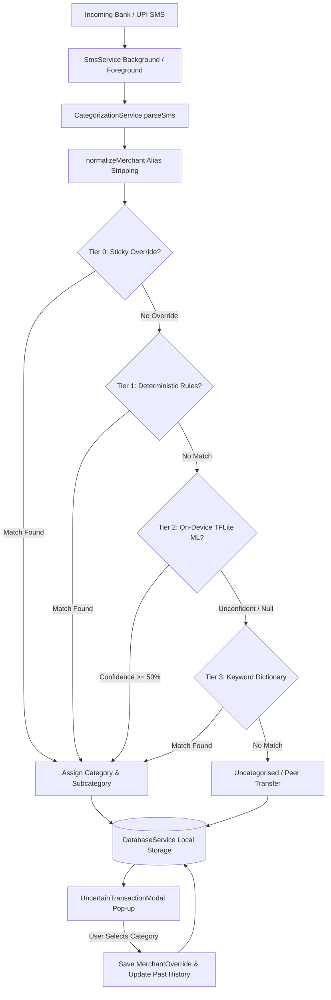

# SpendSense 💸

<p align="center">
  
  
  
  
  
</p>

**SpendSense** is an intelligent, privacy-first personal finance and automated expense management app built with Flutter. Powered by an on-device TensorFlow Lite machine learning engine, SpendSense automatically detects and categorizes bank and UPI SMS messages with zero cloud data transmission. Everything stays 100% private, offline, and secure on your device.

---

## 🌟 Highlights & Key Features

### 🤖 4-Tier Hybrid Categorization Engine
SpendSense uses a multi-layered categorization pipeline ensuring near-100% classification accuracy without ever sending data off-device:
1. **Tier 0: Sticky User Overrides (Self-Learning Memory)**:
   - Your personal choices take absolute precedence.
   - When you categorize a payee, SpendSense permanently remembers it for all future transactions.
2. **Tier 1: High-Priority Deterministic Normalization**:
   - Normalizes complex merchant aliases, bank SMS artifacts, and transaction noise.
   - Built-in support for Indian market staples: `DMart`, `Indian Railways / IRCTC`, `7-Eleven`, `Bikaner Sweets`, `Swiggy`, `Zomato`, `Blinkit`, `Zepto`, and more.
3. **Tier 2: On-Device TensorFlow Lite ML Model**:
   - Deep learning neural network model running locally via `tflite_flutter`.
   - Classifies transactions into 15 canonical spending categories with sub-millisecond inference and confidence scoring.
4. **Tier 3: Heuristic Keyword Dictionary**:
   - Broad keyword mapping dictionary providing reliable fallback categorization.

### 🧠 Interactive Self-Learning & Retroactive History Cascading
- **Automatic App-Open Modal**: When an unclassified payment or ambiguous peer transfer arrives, SpendSense prompts you with an interactive popup on app open or live in the foreground.
- **One-Tap Memory**: Assign a category once, and SpendSense auto-categorizes future payments to that person or store without asking again.
- **Retroactive Cascading**: Assigning or editing a category in the popup or in the Transaction Detail Sheet retroactively updates all past historical transactions for that payee.
- **Clean Sole-Transaction Reset**: If you delete the only transaction for a merchant, SpendSense wipes the override memory so future payments ask for categorization again.
- **Deletion Tombstoning**: Permanently protects deleted transactions against telephony background replay or restart re-adds.

### 📩 Real-Time & Background SMS Detection
- Background telephony listener parses incoming bank & UPI transactional SMS messages automatically.
- Extracts key financial metadata:
  - **Amount** (₹ INR)
  - **Transaction Type** (Debit / Credit)
  - **Payee / Merchant** (UPI VPA, recipient name, or store alias)
  - **Payment Mode** (UPI, Credit Card, Debit Card, ATM, Auto-debit / NACH)
  - **Account Number** (e.g. `XX888`)
  - **Bank Reference / UTR Number**

### 📊 Financial Pulse & Analytics Dashboard
- **Live Weekly Cash Flow**: Dynamic bar charts tracking daily and weekly expense velocity (`fl_chart`).
- **Category Spending Pulse**: Visual category breakdown with percentage tracking and custom color tokens.
- **Monthly Budget Engine**: Set custom limits per category with real-time budget usage progress and alerts.
- **Smart Automated Insights**: Month-over-month comparisons, peak spending days, and budget status summaries.
- **Subscription Tracker**: Automatically detects recurring monthly subscriptions (e.g. Netflix, Spotify, utilities) from historical data.

### 📄 Export & Statements
- **PDF Financial Statements**: Generate official, beautifully formatted monthly or annual PDF statement reports (`pdf`, `printing`).
- **CSV Data Export**: Export complete transaction records to CSV for spreadsheet analysis.

### 🔒 100% Local & Privacy-First
- Zero external servers.
- Zero analytics tracking.
- Zero financial data leaving your phone.

---

## 🏛 Architecture & Processing Flow



---

## 📂 Project Structure

```
SpendSense/
├── android/                         # Native Android configuration & telephony permissions
├── assets/
│   ├── models/
│   │   ├── model.tflite             # SpendSense 15-Class On-Device TFLite Model
│   │   └── labels.txt               # Category & Merchant Head Labels
│   ├── icons/                       # Brand & UI asset icons
│   └── fonts/                       # Custom typography assets
├── lib/
│   ├── core/                        # Global constants, CategoryConstants, color palettes
│   ├── routes/                      # GoRouter definitions & root navigator key
│   ├── theme/                       # AppTheme tokens, typography & dark/light palettes
│   ├── widgets/                     # Core reusable widgets & AppScaffold shell
│   ├── services/
│   │   ├── app_state.dart           # Global state manager & reactive modal dispatcher
│   │   ├── database_service.dart    # SharedPreferences local storage, overrides & tombstones
│   │   ├── categorization_service.dart # 4-Tier Hybrid Categorization & SMS Regex Engine
│   │   ├── ml_categorization_service.dart # TFLite interpreter & tokenization pipeline
│   │   ├── sms_service.dart         # Telephony background isolate & foreground SMS listener
│   │   └── pdf_statement_service.dart # PDF statement generator
│   └── presentation/
│       ├── home_screen/             # Dashboard, balance card, recent transactions & modal
│       ├── history_screen/          # Transaction history, search, filtering & detail sheet
│       ├── dashboard_screen/        # Advanced spending analytics & category breakdown
│       ├── profile_screen/          # User settings, data export & reset
│       └── onboarding_screen/       # First-time permissions & income setup
├── test/
│   ├── categorization_override_test.dart # Sticky memory, retroactive cascading & delete tests
│   ├── ml_categorization_service_test.dart # Normalization, SMS parsing & ML pipeline tests
│   └── pdf_statement_service_test.dart   # PDF generation verification
└── pubspec.yaml                     # Dependencies & asset declarations
```

---

## 🏷 Supported Categories

SpendSense classifies transactions into **15 canonical categories** synchronized with the ML model:

| Category | Typical Merchants / Payees |
| :--- | :--- |
| 🍔 **Food** | Swiggy, Zomato, KFC, McDonald's, Bikaner Sweets, Cafes, Restaurants |
| 🛒 **Groceries** | DMart, Blinkit, Zepto, BigBasket, 7-Eleven, Reliance Fresh, Kirana stores |
| 🚗 **Transport** | Uber, Ola, Rapido, Metro, Fuel (IOCL, HPCL, BPCL), IRCTC, Indian Railways |
| 🛍 **Shopping** | Amazon, Flipkart, Myntra, Ajio, Zara, Decathlon, H&M, Croma |
| ⚡ **Utilities** | Electricity boards, Water bills, Gas cylinders, Mobile recharge (Airtel, Jio) |
| 🍿 **Entertainment**| BookMyShow, PVR, INOX, Gaming, Events |
| 📺 **Subscriptions**| Netflix, Spotify, Amazon Prime, Hotstar, YouTube Premium |
| 🏥 **Medical** | Apollo Pharmacy, 1mg, Hospitals, Clinics, Diagnostics |
| 🏠 **Housing** | Rent payments, Society maintenance, Home repairs |
| 🎓 **Education** | Tuition fees, School/College fees, Coursera, Udemy |
| ⛽ **Fuel** | Petrol pumps, CNG stations |
| ✈️ **Travel** | Airlines (IndiGo, Air India, SpiceJet), Hotels, MakeMyTrip |
| 💳 **EMI** | Loan repayments, Credit card EMIs, Bajaj Finserv |
| 👤 **Personal** | Peer-to-peer transfers, Personal spending |
| 💰 **Income** | Salary, Freelance payouts, Refunds, Cashbacks |

---

## 🚀 Getting Started

### Prerequisites
- [Flutter SDK](https://docs.flutter.dev/get-started/install) (v3.16.0 or higher)
- Android Studio / VS Code with Flutter extension
- An Android device or emulator with SMS capability (for real-time SMS testing)

### Installation

1. **Clone the repository**:
   ```bash
   git clone https://github.com/anshvermadev/SpendSense.git
   cd SpendSense
   ```

2. **Install dependencies**:
   ```bash
   flutter pub get
   ```

3. **Run tests**:
   ```bash
   flutter test
   ```

4. **Launch on your device**:
   ```bash
   flutter run
   ```

> **Note for Windows Users**: Enable **Developer Mode** in Windows Settings to allow symlinks required by native plugins during the build process.

---

## 🧪 Testing

SpendSense includes an automated unit test suite verifying:
- Indian merchant normalization (`DMart`, `Indian Railways`, `7-Eleven`, `Bikaner Sweets`)
- Real SMS parsing across credit/debit, account numbers, and bank reference IDs
- Interactive categorization memory overrides
- Retroactive historical transaction updates
- Sole-transaction deletion & override reset
- PDF statement generation

Run all tests with:
```bash
flutter test
```

---

## 🔒 Privacy Guarantee

SpendSense is committed to absolute privacy:
- **No Analytics SDKs**: No Firebase Analytics, no Mixpanel, no Facebook SDK.
- **No Network Requests**: SpendSense never makes outgoing HTTP/HTTPS network calls with your transaction data.
- **Local Storage Only**: All transaction logs, budgets, and merchant overrides are stored locally in private device storage (`SharedPreferences`).

---

## 📄 License

This project is licensed under the MIT License - see the [LICENSE](LICENSE) file for details.
